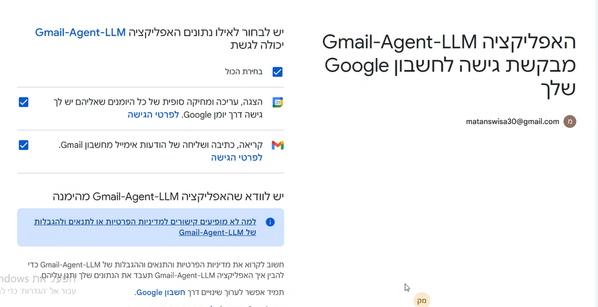
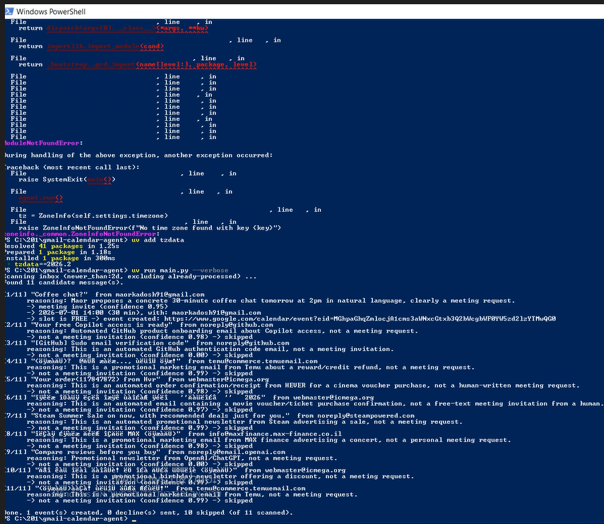
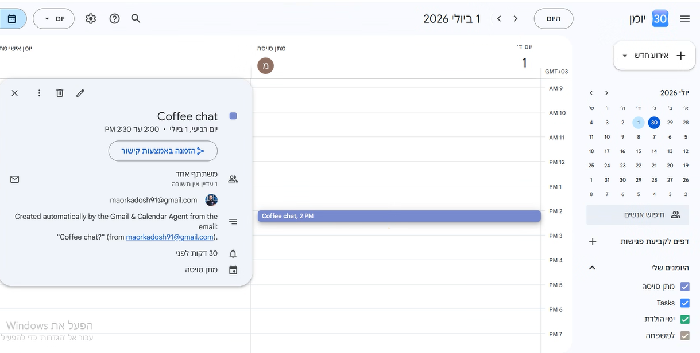
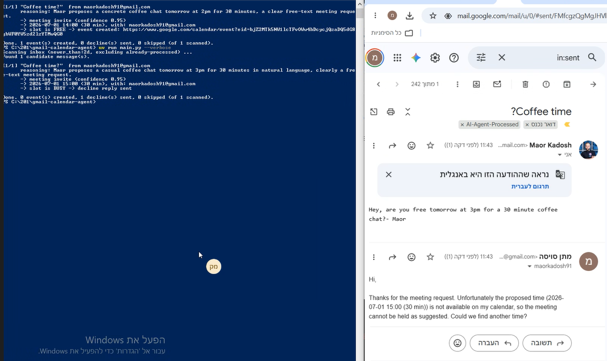
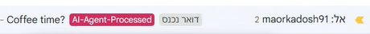

# Gmail & Calendar Agent

> **L08 – Bonus Assignment: Gmail & Calendar Agent** — an AI agent that reads recent
> Gmail messages, recognises *free-text* meeting invitations, checks Google Calendar
> for availability, and either books the meeting or replies that it cannot be held.

<div dir="rtl">

## תקציר (עברית)

סוכן AI המתחבר לחשבון Gmail באמצעות OAuth, סורק את הודעות הדואר מהיומיים האחרונים,
מזהה בעזרת מודל שפה (LLM) הזמנות לפגישה המנוסחות בשפה חופשית, מחלץ את התאריך, השעה,
המשתתפים והמיקום, ובודק זמינות ב‑Google Calendar:

- **אם הזמן פנוי** – נוצר אירוע מתאים בלוח השנה.
- **אם הזמן תפוס** – נשלח מייל חוזר המודיע כי לא ניתן לקיים את הפגישה.

זיהוי הכוונה משלב **חוקים** (סינון ראשוני מהיר) יחד עם **LLM** (הכרעה סופית בשפה חופשית),
כפי שנדרש במטלה.

</div>

---

## What it does (the workflow)

The agent implements the six-step workflow from the assignment specification:

1. **Scan emails** — read inbox messages from the last *2 days only* (configurable).
2. **Detect a meeting invitation** — identify a *free-text* invite (not a formal
   `Calendar Invite`/`.ics`), using a hybrid of keyword rules + an LLM.
3. **Extract the details** — date, time, duration, participants and location, via the LLM.
4. **Check calendar availability** — query Google Calendar free/busy for that slot.
5. **If free** — create a matching event on Google Calendar.
6. **If busy** — send a reply email: *"the meeting cannot be held"*.

Each processed message is tagged with a Gmail label (`AI-Agent-Processed`) so the agent
never acts on the same email twice.

## Why a hybrid (rules + LLM)?

Classic Gmail filters key off the sender or rigid keywords. They identify a free-text
invitation correctly only ~40% of the time because intent is expressed in natural
language ("let's grab 30 min tomorrow at 2", "are you free Sunday afternoon?"). This
project therefore uses **rules as a cheap pre-filter and signal**, and an **LLM as the
final judge** of intent and the extractor of structured details. See
[`PRD.md`](PRD.md) §Design decisions for the full rationale.

---

## Project layout

```
gmail-calendar-agent/
├── README.md                  ← this file
├── PRD.md                     ← product requirements (what & why)
├── PLAN.md                    ← implementation plan (how)
├── TODO.md                    ← task checklist / status
├── pyproject.toml             ← uv project + dependencies
├── .env.example               ← template for secrets/config (copy to .env)
├── .gitignore                 ← ignores credentials.json, token.json, .env
├── main.py                    ← CLI entry point
├── gmail-meeting-scheduler/   ← the Skill
│   └── SKILL.md               ← Skill definition (when/how to use the agent)
├── screenshots/               ← screenshots embedded in this README
├── gmail_calendar_agent/      ← the package
│   ├── config.py              ← settings loaded from env / .env
│   ├── auth.py                ← Google OAuth (credentials.json → token.json)
│   ├── gmail_client.py        ← read messages, send replies, manage labels
│   ├── calendar_client.py     ← free/busy check + event creation
│   ├── classifier.py          ← rule-based pre-filter (keywords/heuristics)
│   ├── llm.py                 ← Anthropic Claude: intent + detail extraction
│   └── agent.py               ← orchestrates the 6-step workflow
└── tests/
    └── test_classifier.py     ← offline tests for the rule layer (no network)
```

---

## Setup

> A full, screenshot-by-screenshot guide for creating the Google **Client** and
> **Token** is in *Appendix A* of the assignment PDF. The short version follows.

### 1. Prerequisites

- Python **3.10+**
- [`uv`](https://docs.astral.sh/uv/) (package manager)
  - Windows PowerShell: `powershell -ExecutionPolicy ByPass -c "irm https://astral.sh/uv/install.ps1 | iex"`
  - macOS / Linux: `curl -LsSf https://astral.sh/uv/install.sh | sh`
- A **dedicated Gmail account** (recommended — do not use a corporate/Outlook account;
  the OAuth flow in this assignment supports Google accounts only).
- An **Anthropic API key** (for the LLM step).

### 2. Google API — Client & Token

1. In the [Google Cloud Console](https://console.cloud.google.com/), create a project.
2. Enable the **Gmail API** and the **Google Calendar API**.
3. Configure the OAuth consent screen (User type *External*) and add your Gmail address
   as a **Test user**.
4. Add the two scopes:
   - `https://www.googleapis.com/auth/gmail.modify`
   - `https://www.googleapis.com/auth/calendar`
5. Create an **OAuth client ID** of type **Desktop app**, download the JSON, and save it
   as `credentials.json` in the project root.

The first time you run the agent, a browser window opens for consent and a `token.json`
is written next to `credentials.json`. Both files are git-ignored.

### 3. Configure secrets

```bash
cp .env.example .env       # then edit .env and set ANTHROPIC_API_KEY
```

On first run the agent also asks for the **Gmail address you authorised** (the
account added as a Test user) and saves it to `.env` as `USER_EMAIL`. That value
pre-selects the right account on Google's consent screen and is verified after
sign-in — so you won't accidentally authorise the wrong account.

### 4. Install & run

```bash
uv sync                    # create the venv and install dependencies

# Safe first run — analyses emails but does NOT create events or send mail:
uv run main.py --dry-run

# Real run:
uv run main.py
```

---

## Usage

```text
uv run main.py [options]

  --dry-run                 Analyse only; never create events or send replies.
  --lookback 2d             Override the inbox look-back window (Gmail syntax).
  --max-emails 20           Cap how many messages to inspect this run.
  --no-reply                Don't send "can't make it" replies on busy slots.
  --reprocess               Ignore the processed-label filter and re-scan everything.
  --verbose                 Print per-email reasoning from the classifier/LLM.
```

Example output:

```text
Scanning inbox (newer_than:2d, excluding already-processed) ...
Found 4 candidate message(s).

[1/4] "Coffee chat?"  from alice@example.com
      → meeting invite (confidence 0.93)
      → 2026-06-26 14:00 (60 min), location: "Cafe Aroma", with: alice@example.com
      → slot is FREE → event created: https://calendar.google.com/...

[2/4] "Re: invoice #4471"  from billing@vendor.com
      → not a meeting invitation (confidence 0.97) → skipped
...
Done. 1 event created, 1 decline sent, 2 skipped.
```

---

## Screenshots / צילומי מסך

<div dir="rtl">

> **למילוי לפני ההגשה:** צלמו את חמשת הצעדים שבטבלה והניחו את הקבצים בתיקיית
> [`screenshots/`](screenshots) **בדיוק בשמות** המופיעים בעמודה "קובץ". התמונות
> יוצגו אוטומטית מתחת לטבלה — אין צורך לערוך עוד דבר ב-README.

</div>

| # | מה לצלם | קובץ |
|---|---------|------|
| 1 | מסך ההסכמה של Google OAuth (consent screen) בעת ההרצה הראשונה | `screenshots/01-oauth-consent.png` |
| 2 | הרצת הסוכן בטרמינל (`uv run main.py`) — סריקת מיילים וזיהוי הזמנה | `screenshots/02-agent-run.png` |
| 3 | האירוע שנוצר ב-Google Calendar (משבצת פנויה) | `screenshots/03-calendar-event.png` |
| 4 | מייל ה"דחייה" שנשלח כשהמשבצת תפוסה | `screenshots/04-decline-email.png` |
| 5 | התווית `AI-Agent-Processed` שהוצמדה למייל ב-Gmail | `screenshots/05-gmail-label.png` |

### 1. Google OAuth consent


### 2. Agent run (terminal output)


### 3. Event created in Google Calendar


### 4. Decline email (busy slot)


### 5. Gmail "processed" label


---

## Security notes

- `credentials.json`, `token.json` and `.env` are **git-ignored** and must never be
  committed. The token grants access to your mailbox and calendar.
- The OAuth token is *scoped* — the agent can read/modify mail and manage the calendar,
  but it never sees your Google password (the consent screen handles authentication,
  similar in spirit to Face-ID: the target app only confirms identity).
- Run `--dry-run` first to verify behaviour before letting the agent act.

## Troubleshooting

Issues commonly hit on a first run, with the fix:

| Symptom | Cause | Fix |
|---|---|---|
| `ZoneInfoNotFoundError: 'No time zone found with key Asia/Jerusalem'` | Windows ships no system IANA tz database; Python's `zoneinfo` needs the `tzdata` package. | Already declared as a dependency — run `uv sync` (or `uv add tzdata`). |
| Browser shows **`Error 403: access_denied`** / *"app is currently being tested, only approved testers can access it"* on the OAuth consent screen | The OAuth app is in **Testing** publishing status and the signing-in Gmail account is not a registered test user. | In [Google Cloud Console](https://console.cloud.google.com/) → **APIs & Services → OAuth consent screen → Test users**, add the Gmail address, then re-run. |
| `anthropic.BadRequestError` whose body is *"Your credit balance is too low to access the Anthropic API"* | The Anthropic account behind `ANTHROPIC_API_KEY` has no credit balance. | Add credit/billing at [console.anthropic.com](https://console.anthropic.com/) → **Plans & Billing**. (Or run without a key for reduced rules-only mode — but it won't book or decline, since it can't extract a concrete time.) |

## Related documents

- [`PRD.md`](PRD.md) — product requirements & design decisions
- [`PLAN.md`](PLAN.md) — implementation plan & milestones
- [`TODO.md`](TODO.md) — task checklist

---

*Course L08 · Dr. Yoram Segal · 2026*
